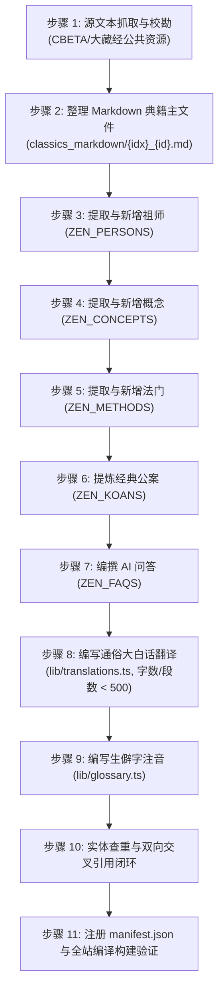

# 禅宗知识库 (chanzong.space) · 22部待从公有领域采集经典待办任务清单

> **项目目标**：依据禅宗知识库（模式 B 战略）长期建设愿景，当前已发布 57 部典籍。本地准备就绪 6 部大典，本清单收录第一梯队待从公有领域（CBETA / 汉文大藏经 / 卍续藏）采集、清洗并按照 **11 步 SOP** 发布的 22 部核心经典。

---

## 📋 任务状态总览

- **已发布经典**：57 部（idx 1 ~ 57）
- **本地就绪待发布**：6 部（《碧岩录》、《从容录》、《宗镜录》、《五灯会元》、《景德传灯录》、《指月录》）
- **待采集核心经典**：**22 部**（本清单）

---

## 🗂️ 22部待采集经典详细清单

### 第一组：五家七宗与历代宗师核心语录（13部）

- [ ] **1. 《宏智正觉禅师广录》（天童宏智广录）**
  - **作者**：宋·宏智正觉
  - **宗派**：曹洞宗（默照禅集大成者）
  - **核心价值**：收录《默照铭》、《坐禅箴》及上堂示众，与大慧宗杲看话禅相映生辉。
- [ ] **2. 《高峰原妙禅师禅要》（高峰禅要）**
  - **作者**：元·高峰原妙
  - **宗派**：临济宗
  - **核心价值**：做工夫之极则，详论“大疑情、大信根、大愤志”参禅三要，单行本全本。
- [ ] **3. 《中峰和尚广录》（幻住庵清规）**
  - **作者**：元·中峰明本
  - **宗派**：临济宗杨岐派
  - **核心价值**：元代禅宗领袖，倡导幻住宗风，论说深入浅出。
- [ ] **4. 《德山宣鉴禅师语录》**
  - **作者**：唐·德山宣鉴
  - **宗派**：宗门巨擘（“德山棒，临济喝”）
  - **核心价值**：直截痛快，棒打一切情解思量。
- [ ] **5. 《雪峰义存禅师语录》**
  - **作者**：唐·雪峰义存
  - **宗派**：闽中宗门巨擘（云门、法眼皆出其门下）
  - **核心价值**：鳌山悟道、滚木球接人，唐五代承前启后之关键祖师。
- [ ] **6. 《玄沙师备禅师语录》（广录）**
  - **作者**：唐·玄沙师备
  - **宗派**：法眼宗先驱
  - **核心价值**：“尽十方世界是真明珠”、“直指不昧灵知”，机锋极其峻烈。
- [ ] **7. 《药山惟俨禅师语录》**
  - **作者**：唐·药山惟俨
  - **宗派**：石头希迁门下、曹洞法源
  - **核心价值**：“云在青天水在瓶”、“思量个不思量底”，曹洞宗思想基石。
- [ ] **8. 《石霜楚圆禅师语录》（慈明语录）**
  - **作者**：宋·石霜楚圆（慈明）
  - **宗派**：临济宗中兴之祖（杨岐方会、黄龙慧南之得法师）
  - **核心价值**：出锥自刺、逆水挽舟，宋代临济两大派别之共同发端。
- [ ] **9. 《杨岐方会禅师语录》**
  - **作者**：宋·杨岐方会
  - **宗派**：临济宗杨岐派开山
  - **核心价值**：“杨岐金刚圈、栗棘蓬”，后世大慧宗杲看话禅源头。
- [ ] **10. 《黄龙慧南禅师语录》**
  - **作者**：宋·黄龙慧南
  - **宗派**：临济宗黄龙派开山
  - **核心价值**：“黄龙三关”（人人有个生缘在何处、我手何似佛手、我脚何似驴脚）。
- [ ] **11. 《密庵咸杰禅师语录》**
  - **作者**：宋·密庵咸杰
  - **宗派**：临济宗杨岐派破庵、松源之师
  - **核心价值**：南宋临济正宗，传灯日本之关键法脉。
- [ ] **12. 《憨山老人梦游集》（精选卷次）**
  - **作者**：明·憨山德清
  - **宗派**：明末四大高僧之一
  - **核心价值**：禅净双修、理事圆融、详析初心参禅做工夫火候与病痛。
- [ ] **13. 《紫柏老人全集》（精选法语）**
  - **作者**：明·紫柏真可
  - **宗派**：明末四大高僧之一
  - **核心价值**：气魄雄浑，提持宗门向上一着，誓护法藏。

---

### 第二组：宗门纲宗、公案与史传（4部）

- [ ] **14. 《人天眼目》（全六卷）**
  - **作者**：宋·智昭
  - **类别**：五家纲宗
  - **核心价值**：全景解析临济、曹洞、沩仰、云门、法眼五家宗风特色、门庭施设与秘传密示，宗门必读教科书。
- [ ] **15. 《林间录》（全二卷）**
  - **作者**：宋·惠洪觉范
  - **类别**：禅林史传与掌故
  - **核心价值**：记录丛林规矩掌故、名宿风仪与文人禅话。
- [ ] **16. 《禅宗决疑集》**
  - **作者**：元·智彻
  - **类别**：参禅问答解疑
  - **核心价值**：专为初入禅门、参话头者辨析真疑与假疑、破除四十八种参禅病。
- [ ] **17. 《空谷道人击节录》**
  - **作者**：明·景隆（空谷）
  - **类别**：公案评唱
  - **核心价值**：明代公案评唱名作，语言脱俗，针砭狂禅。

---

### 第三组：达摩印心根本经论与丛林清规（5部）

- [ ] **18. 《楞伽阿跋多罗宝经》（四卷本）**
  - **译者**：刘宋·求那跋陀罗
  - **类别**：达摩印心宝典
  - **核心价值**：达摩祖师付嘱二祖慧可“以此经印心”、“直指自性、五法三自性八识二无我”，禅宗立宗根本之经。
- [ ] **19. 《肇论》（全四论合编）**
  - **作者**：东晋·僧肇
  - **类别**：般若中观巅峰
  - **核心价值**：《物不迁论》、《不真空论》、《般若无知论》、《涅槃无名论》，中国佛学玄理最高成就，禅宗历代引用极夥。
- [ ] **20. 《注维摩诘经》（精编十卷）**
  - **注解者**：僧肇、道生等古德
  - **类别**：不二法门注疏
  - **核心价值**：详解“默然显道”、“直心是道场”、“在世出世”大乘不二深旨。
- [ ] **21. 《敕修百丈清规》（全八卷）**
  - **编纂者**：元·德辉 编
  - **类别**：丛林根本法度
  - **核心价值**：“一日不作，一日不食”，天下丛林组织制度与安单修道之根本遵循。
- [ ] **22. 《禅苑清规》（全十卷）**
  - **编纂者**：宋·长芦宗赜 编
  - **类别**：现存最完整宋代禅门清规
  - **核心价值**：详载挂搭、坐禅、普请、过堂、茶礼等全套修道生活细则。

---

## 🛠️ 实施流程（严格遵守 11 步 SOP）

---

## 📌 执行原则
1. **质量第一**：追求通俗大白话、深入浅出，严禁粗制滥造与浮于表面；
2. **零悬空引用**：所有 `related*` 字段必须真实对应、语义契合；
3. **稳步推进**：在本地已就绪的 6 部大典发布完成后，按批次有节奏地抓取并发布上述 22 部核心经典。
